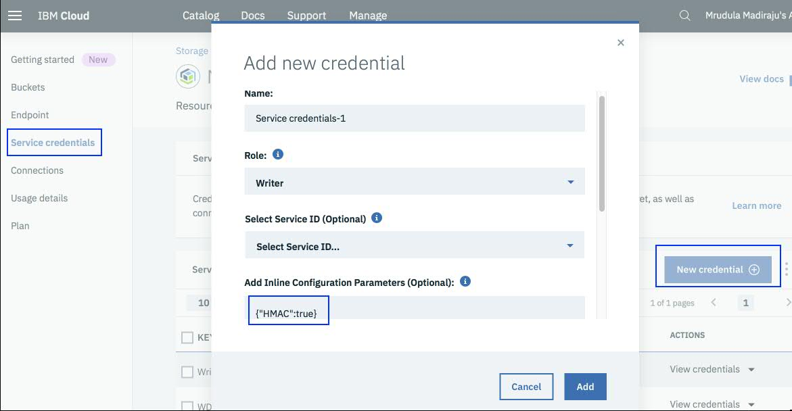

---

copyright:
  years: 2017, 2019
lastupdated: "2019-01-31"

---

<!-- Attribute definitions -->
{:new_window: target="_blank"}
{:shortdesc: .shortdesc}
{:codeblock: .codeblock}
{:screen: .screen}
{:pre: .pre}

# Configuring clusters to work with IBM COS S3 object stores
{: #config-cluster-cos}

{{site.data.keyword.cos_full_notm}} is a highly scalable cloud storage service, designed for high durability, resiliency and security. See [{{site.data.keyword.cos_full_notm}}](/docs/services/cloud-object-storage?topic=cloud-object-storage-about-ibm-cloud-object-storage).

This topic explains how to configure an {{site.data.keyword.iae_full_notm}} cluster to connect to data and applications stored an object store. {{site.data.keyword.iae_full_notm}} uses HDP’s default AWS open source object storage connectors to access data from Cloud Object Storage  when running HDFS, Hive, or Mapreduce jobs. However, when running Spark jobs, the system is preconfigured to use IBM’s open source Stocator libraries that offer better performance and optimization for large object reads and writes as compared to the default AWS connectors. See  [Stocator - Storage Connector for Apache  Spark](https://github.com/SparkTC/stocator).

As described in [Best Practices](/docs/services/AnalyticsEngine?topic=AnalyticsEngine-best-practices), you should use {{site.data.keyword.cos_full_notm}} as your primary data source and sink. Apart from the data itself, the application or job binaries, for example for a Spark Python file or a Yarn application JAR, can reside in the object store. This way you can make your cluster stateless, giving you the flexibility to spin up {{site.data.keyword.iae_full_notm}} clusters when you need them. See  [Choose the right Cloud Object Storage configuration](/docs/services/AnalyticsEngine?topic=AnalyticsEngine-best-practices#encryption).

## Getting the {{site.data.keyword.cos_full_notm}} credentials

To use {{site.data.keyword.cos_full_notm}} as your primary data source:

1. Provision an {{site.data.keyword.cos_full_notm}} service instance from the {{site.data.keyword.Bluemix_short}} catalog.
1. Get the credentials to your newly created Object Storage service instance:
  1. Click **Service Credentials** in the navigation pane.
  1. Click **New Credential** button and choose the desired options. By default, Cloud Object Storage uses [IAM-style](/docs/services/cloud-object-storage/iam?topic=cloud-object-storage-getting-started-with-iam) credentials. If you want to work with HMAC-style credentials, you need to provide the inline configuration parameter {"HMAC":true}.

    

## Cloud Object Storage credentials and endpoints   

The following example shows the Object Storage credentials:

```
{
  "apikey": "asdf1234asdf1234asdf1234asdf1234asdf1234",
  "cos_hmac_keys": {
    "access_key_id": "aaaa1111bbbbb222222ccccc3333333ddddd44444",
    "secret_access_key": "ZZZZYYYYYXXXXXXWWWWWVVVVVVUUUUU"
  },
  ……..
}
```
- **API key credentials**  

 In the example, `apikey` is the IAM API Key. IBM IAM authentication using IAM API keys or IAM tokens gives you fine grained control over user access to Cloud Object Storage buckets. See [Getting started with IAM](/docs/services/cloud-object-storage/iam?topic=cloud-object-storage-getting-started-with-iam).

- **Cloud Object Storage HMAC credentials**

 In the example, the access key and secret key can be used for traditional HMAC-style access.

- **Service endpoints**

 To access the Object Storage service instance from  {{site.data.keyword.iae_full_notm}} you need the endpoint. See [Selecting endpoints](https://ibm-public-cos.github.io/crs-docs/endpoints) for help on which endpoints you need to use based on your Cloud Object Storage bucket type, such as regional versus cross-regional.

 You can also view the endpoints across regions by clicking **EndPoint** in the navigation pane of the Cloud Object Storage service instance page. Always choose the **private** endpoint. Using the public endpoint is slower and more expensive. An example of an endpoint URL is:

 ```s3-api.us-geo.objectstorage.service.networklayer.com ```

## Authentication parameters to Cloud Object Storage

Authentication and endpoint information must be configured in {{site.data.keyword.iae_full_notm}} to enable integration with all components. You can select to use either or both styles of authentication described in the previous section.

### HMAC style authentication parameters

For HMAC style authentication, you must define the following parameters in {{site.data.keyword.iae_full_notm}}:
```
fs.cos.<servicename>.access.key=<Access Key ID>
fs.cos.<servicename>.endpoint=<EndPoint URL>
fs.cos.<servicename>.secret.key=<Secret Access Key>
```
The value for `<servicename>` can be any literal such as `awsservice` or `myobjectstore`. `<servicename>` is primarily used to distinguish between the different object storage instances that are configured. For example, if you want to work with more than one object storage instance, you can use service names to distinguish between them.

### IAM style authentication parameters

For IAM style authentication, you must define the following parameters in {{site.data.keyword.iae_full_notm}}:
```
fs.cos.<servicename>.v2.signer.type=false  
fs.cos.<servicename>.endpoint=<EndPoint URL>
fs.cos.<servicename>.iam.api.key=<IAM API Key>
```
Note that the signer parameter must always be set to false.

### IAM token authentication parameters

Using the API key credentials or the HMAC style credentials is like having root access to the object store. If you are using {{site.data.keyword.iae_full_notm}} in a single-user mode, you can use either one of these forms of authentication.  

However, if you are an administrator and want finer grained control across multiple users, you should use IAM token authentication. That way, you can enable access to the Object Storage instance for selected users who then use their IAM token for runtime access. See [Inviting users and assigning access](/docs/services/cloud-object-storage/iam?topic=cloud-object-storage-users-and-service-ids).

Bear in mind that the token expires in an hour which means that it is better to specify it at runtime rather than to define it in the core-site.xml file.

For IAM token authentication, you must define the following parameter in {{site.data.keyword.iae_full_notm}}:

```
fs.cos.<servicename>.iam.token=<IAM-token-example-2342342sdfasf34234234asf……..
```
The IAM token for each user is obtained by using the `ibmcloud iam oauth-tokens` command. See [Retrieving IAM access tokens](/docs/services/AnalyticsEngine?topic=AnalyticsEngine-retrieve-iam-token).

## URI for accessing objects in Object Storage

Use the following URI to access data objects in a Cloud Object Storage bucket:
```
cos://<bucket_name>.<servicename>/<object_name>```

For example:
```
cos://mybucket.myprodservice/detail.txt```

After you have configured {{site.data.keyword.iae_full_notm}} to work with Cloud Object Storage by using one of the methods described in the following section about  configuration methods, you can access objects in Cloud Object Storage from Spark, Hive, or HDFS via the URI. You will find references of how to do this in the examples in the following section.

## Configuration methods

To enable an application to connect to Cloud Object Storage, you must update the cluster configuration file to include the Cloud Object Storage credentials and other values. These values must be added to the core-site.xml file as a set of key/value pairs.

You can configure Object Storage by using one of the following four methods:

* [Create an {{site.data.keyword.iae_full_notm}} service instance using advanced custom provisioning options](/docs/services/AnalyticsEngine?topic=AnalyticsEngine-advanced-provisioning-options). This is the preferred and most efficient method.
* [Specify the properties at runtime](/docs/services/AnalyticsEngine?topic=AnalyticsEngine-specify-props-runtime)
* [Customize the cluster using a customization script](/docs/services/AnalyticsEngine?topic=AnalyticsEngine-cust-cluster-script)
* [Configure the cluster via the Ambari UI after it was created](/docs/services/AnalyticsEngine?topic=AnalyticsEngine-config-cos-ambari)
