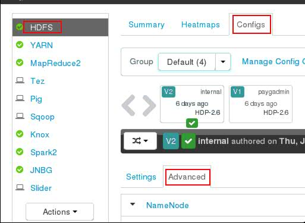
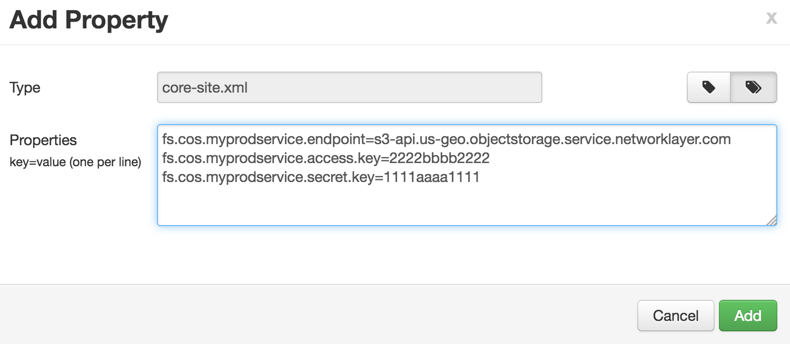
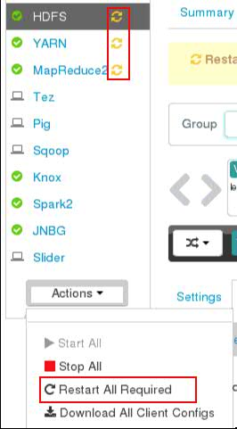

---

copyright:
  years: 2017, 2018
lastupdated: "2018-11-14"

---

<!-- Attribute definitions -->
{:new_window: target="_blank"}
{:shortdesc: .shortdesc}
{:codeblock: .codeblock}
{:screen: .screen}
{:pre: .pre}

# Configure a Cloud Object Storage connection through Ambari

You can configure the cluster to access data objects in IBM Cloud Object Storage by using the Amabri UI. In Ambari, you can add  properties and values to the core-site.xml file to the core-site.xml file on your cluster instance.

1. Open the Ambari console, and then, on the dashboard, click **HDFS** > **Configs** > **Advanced** to see the advanced configuration options for  HDFS. 

 
2. Scroll down the page until you see `Custom core-site` and click **Add Property**.

 

3. Enter the desired properties in the Properties field and then click **Add** to save your changes. For information about which properties to add, see [Authentication parameters to Cloud Object Storage](/docs/services/AnalyticsEngine/configure-COS-S3-object-storage.html#authentication-parameters-to-cloud-object-storage).

 
4. Ambari indicates which services need to be restarted. Click **Restart All Required** to restart all services affected by your  changes.

 
